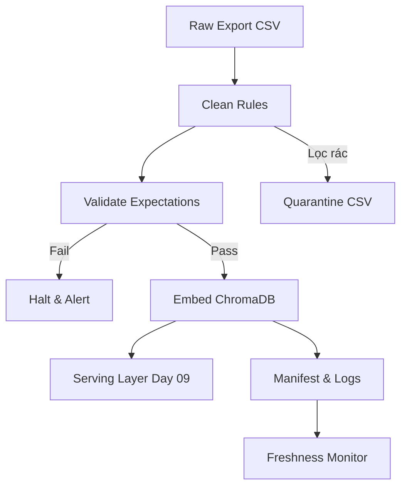

# Kiến trúc pipeline — Lab Day 10

**Nhóm:** Nhóm Antigravity  
**Cập nhật:** Hôm nay

---

## 1. Sơ đồ luồng

## 2. Ranh giới trách nhiệm

| Thành phần | Input | Output | Owner nhóm |
|------------|-------|--------|--------------|
| Ingest | policy_export_dirty.csv | In-memory raw records | Ingestion Owner |
| Transform | In-memory raw | Cleaned records & Quarantine list | Cleaning Owner |
| Quality | Cleaned records | Expectation Results (Halt/Pass) | Quality Owner |
| Embed | Cleaned records | ChromaDB Upsert & Manifest | Embed Owner |
| Monitor | Manifest | Freshness Alert (FAIL/PASS) | Monitoring Owner |

## 3. Idempotency & rerun

- Embed được thiết kế theo phương châm idempotent: upsert theo `chunk_id`. Nếu chạy rerun 2 lần thì sẽ ghi đè lên thay vì sinh ra duplicate vector.
- Ngoài ra, trước khi upsert, có cơ chế `embed_prune`: xóa các `id` cũ không còn tồn tại trong list cleaned hiện tại.

## 4. Liên hệ Day 09

Pipeline này xử lý file CSV export từ nhiều nguồn (trong đó có dữ liệu của CS và IT Helpdesk tương ứng với Day 09). Pipeline chịu trách nhiệm làm sạch dữ liệu, cập nhật bản mới nhất và đẩy vào ChromaDB (`day10_kb`) nhằm cung cấp bộ nhớ Vector chuẩn, sạch sẽ cho multi-agent lấy retrieval.

## 5. Rủi ro đã biết

- Dữ liệu lỗi structure có thể lọt qua một số rule parsing nếu format date không phải YYYY-MM-DD hay DD/MM/YYYY.
- Expectation hiện tại mới áp dụng halt cục bộ, cần tích hợp Great Expectations cho hệ thống production lớn.
